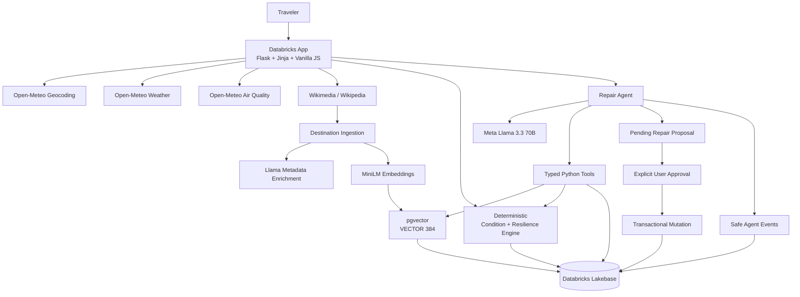

# DETOUR

> **Plans change. Yours can too.**

**DETOUR is a self-healing travel intelligence system that builds real itineraries, measures their resilience to changing conditions, stress-tests them against adverse scenarios, and uses a tool-calling AI agent to propose the smallest useful repair.**

**Live Databricks App:** https://detour-7474652919339658.aws.databricksapps.com/  
**GitHub:** https://github.com/sleepysoba/detour

---

## Why DETOUR?

Most AI travel planners solve the problem once:

> “Here is your itinerary.”

DETOUR treats travel planning as a dynamic system.

It builds an itinerary from real destination information, evaluates how vulnerable each activity is to weather and air quality, and calculates a trip-level **Resilience Score**.

The traveler can then simulate a **Rainstorm**, **Heatwave**, or **Poor AQI** event and immediately see what becomes vulnerable.

If the trip degrades, DETOUR’s Llama-powered repair agent investigates the itinerary, retrieves safer real attractions, evaluates alternatives, and proposes a minimal repair.

The AI does **not** silently modify the trip. The user reviews a before/after diff and explicitly chooses whether to apply the detour. Only then is Lakebase mutated transactionally.

---

## Judge / Demo Flow

```text
CREATE TRIP
→ REAL ITINERARY
→ LIVE RESILIENCE
→ SIMULATE RAINSTORM / HEATWAVE / POOR AQI
→ RESILIENCE FALLS
→ VULNERABLE ACTIVITIES ARE IDENTIFIED
→ REPAIR MY TRIP
→ LLAMA CALLS REAL TOOLS
→ PROPOSED DETOUR
→ BEFORE / AFTER DIFF
→ USER EXPLICITLY APPLIES
→ LAKEBASE MUTATES
→ RESILIENCE IMPROVES
→ AGENT TRACE IS VIEWABLE
```

---

## Core Engineering Principle

> **AI for judgment. Deterministic code for facts and constraints.**

DETOUR deliberately separates responsibilities:

| Responsibility | Implementation |
|---|---|
| Facts / constraints | Deterministic Python |
| Semantic discovery | MiniLM + pgvector |
| Judgment | Meta Llama 3.3 70B |
| State mutation | Narrow validated Python tools |
| Observability | Python logging + `agent_events` |

The LLM never writes arbitrary SQL and never silently changes an itinerary.

---

## Architecture



---

## What Makes DETOUR Agentic?

DETOUR does not use an LLM as a decorative chatbot.

The repair system runs an explicit OpenAI-compatible **function-calling loop** against:

```text
system.ai.meta-llama-3-3-70b-instruct
```

The production agent uses narrow typed tools such as:

- `get_trip_state`
- `get_trip_resilience`
- `search_attractions`
- `evaluate_candidate`
- `save_repair_proposal`

The agent investigates the trip, retrieves alternatives, evaluates candidates under the active scenario, and persists a validated repair proposal.

Its priorities are:

1. Reduce risk
2. Preserve traveler preferences
3. Preserve existing attractions when possible
4. Avoid duplicates
5. Minimize disruption
6. Preserve pace

No LangChain, LangGraph, CrewAI, or MCP layer is used. The tools are internal to one application, so a direct typed function-calling loop is simpler, more inspectable, and easier to validate.

---

## Human-in-the-Loop State Mutation

A repair follows this lifecycle:

```text
Agent investigates
        ↓
Creates PENDING repair
        ↓
Backend validates proposal
        ↓
UI shows before / after diff
        ↓
User explicitly approves
        ↓
Transactional backend mutation
        ↓
Repair marked APPLIED
```

This gives DETOUR a real write-capable agent while keeping persistent state changes controlled and auditable.

---

## Resilience Engine

Every itinerary activity receives a deterministic condition score using factors including:

- precipitation
- temperature
- wind
- air quality
- indoor / outdoor / mixed classification
- weather sensitivity

Activities are labeled:

- **GO**
- **CAUTION**
- **AT RISK**

Those activity scores roll into a trip-level **Resilience Score from 0–100**.

The LLM does not invent these scores.

---

## Stress Testing

DETOUR supports three simulated scenarios:

- **Rainstorm**
- **Heatwave**
- **Poor AQI**

Scenario transformations are immutable and always labeled **SIMULATED**.

They never overwrite real Open-Meteo conditions.

Example:

```text
LIVE CONDITIONS
88 / 100

SIMULATED RAINSTORM
70 / 100
```

The user can immediately see which activities became vulnerable and why.

---

## Grounded Attraction Intelligence

DETOUR does not allow the LLM to invent attractions.

Destination ingestion follows:

```text
City
→ Open-Meteo geocoding
→ Wikimedia geographic discovery
→ quality filtering
→ Llama metadata enrichment
→ MiniLM embeddings
→ Lakebase persistence
```

Llama may classify or summarize a real Wikimedia attraction, but the attraction itself must originate from retrieved source data.

Stored attraction metadata includes:

- category
- indoor / outdoor / mixed
- weather sensitivity
- activity level
- estimated duration
- tags
- traveler summary
- Wikimedia source fields
- embedding model metadata
- `VECTOR(384)` embedding

---

## Semantic Retrieval

DETOUR uses:

```text
sentence-transformers/all-MiniLM-L6-v2
```

with:

- 384-dimensional embeddings
- PostgreSQL `VECTOR(384)`
- HNSW index
- cosine similarity retrieval

This allows the repair agent to retrieve attractions by meaning rather than exact keyword matches.

---

## Persistent State with Lakebase

DETOUR uses Databricks Lakebase / PostgreSQL as its system of record.

Primary tables:

```text
destinations
trips
attractions
itinerary_items
weather_snapshots
repair_runs
repair_actions
agent_events
```

Lakebase stores both normal application state and AI-generated repair actions.

Once a user approves a detour, the itinerary mutation is persistent.

---

## Agent Observability

DETOUR stores safe agent execution events in `agent_events`.

The UI exposes an **Agent Trace** containing events such as:

```text
Agent started
Loaded trip state
Evaluated scenario
Retrieved alternatives
Evaluated candidate
Saved proposal
Applied repair
```

Trace metadata can include tool-call counts, model-call counts, and execution time.

DETOUR intentionally does **not** expose:

- chain-of-thought
- hidden model reasoning
- full internal prompts
- credentials
- secrets

---

## Example Real Repair

During Phase 3 integration testing, a real Boulder itinerary produced approximately:

```text
Live resilience:
88 / 100

Simulated Rainstorm:
70 / 100
```

The most vulnerable activity was:

```text
Pearl Street Mall
AT RISK
26 / 100
```

The agent retrieved and evaluated alternatives and proposed:

```text
BEFORE
Pearl Street Mall
26 / 100 — AT RISK

AFTER
Colorado Chautauqua
64 / 100 — CAUTION
```

Projected Rainstorm resilience:

```text
70 → 78
```

Observed agent execution:

```text
5 tool calls
5 model calls
~27 seconds
1 proposal save attempt
0 validation failures
fallback not used
```

The approved repair reduced the number of vulnerable activities.

---

## Technology Stack

### Platform
- Databricks Apps
- Databricks Lakebase / PostgreSQL
- pgvector

### Backend
- Python
- Flask
- Jinja
- Gunicorn

### Frontend
- Vanilla JavaScript
- Vanilla CSS

### AI
- Databricks AI Gateway
- Meta Llama 3.3 70B Instruct
- Explicit OpenAI-compatible function calling

### Embeddings
- `sentence-transformers/all-MiniLM-L6-v2`
- `VECTOR(384)`
- HNSW cosine search

### External Data
- Open-Meteo Geocoding API
- Open-Meteo Weather API
- Open-Meteo Air Quality API
- Wikimedia / Wikipedia

---

## Capstone Requirements Mapping

| Requirement | DETOUR |
|---|---|
| Databricks App frontend | ✅ Flask/Jinja app deployed on Databricks Apps |
| Lakebase | ✅ Persistent trips, attractions, itinerary state, repairs, traces |
| Third-party API | ✅ Open-Meteo + Wikimedia |
| Unstructured data | ✅ Wikimedia attraction descriptions |
| Semantic retrieval | ✅ MiniLM + pgvector |
| AI model | ✅ Meta Llama 3.3 70B |
| AI agent | ✅ Explicit typed function-calling loop |
| Retrieval actions | ✅ Trip state, resilience, semantic attraction search |
| Persistent writes | ✅ Repair proposals + approved itinerary mutation |
| Human approval | ✅ Pending proposal → explicit Apply Detour |
| Observability | ✅ Persistent `agent_events` trace |
| Creative differentiation | ✅ Self-healing itinerary + resilience stress testing |

---

## Project Structure

```text
.
├── app.yaml
├── requirements.txt
├── setup_secrets.py
├── detour/
│   ├── services/
│   ├── templates/
│   ├── static/
│   └── ...
├── scripts/
│   ├── phase1_smoke.py
│   ├── phase2_smoke.py
│   └── phase3_smoke.py
└── tests/
```

The project was built incrementally, with each phase reviewed before moving forward.

---

## Verification

The project includes:

- real Open-Meteo smoke tests
- real Wikimedia attraction discovery
- real MiniLM embedding generation
- real `VECTOR(384)` insert/query against Lakebase
- real Databricks Llama chat completion
- real function calling
- real repair-agent execution
- persistent agent tracing
- deterministic scenario scoring
- transactional repair application
- comprehensive automated tests

At the latest deployment-prep checkpoint:

```text
98 tests passed
0 failed
```

---

## Local Development

Install dependencies:

```bash
pip install -r requirements.txt
```

Configure local environment variables in `.env`.

Never commit `.env` or credentials.

Initialize Databricks-backed secrets:

```bash
python setup_secrets.py
```

Then run the Flask application using the repository configuration.

---

## Security / Safety Design

DETOUR deliberately restricts the model’s authority.

The LLM:

- cannot write arbitrary SQL
- cannot directly apply a repair
- cannot invent attraction IDs
- cannot overwrite real weather with simulated conditions
- must operate through validated Python tools

Persistent mutations require explicit user approval.

---

## Known Limitations

- Repair-agent latency can be approximately 20–30 seconds because the agent performs multiple real model/tool calls.
- Attraction coverage depends on Wikimedia geographic data quality for the destination.
- Stress-test scenarios are intentionally simplified deterministic transformations, not weather forecasts.
- Travel-time routing is outside the current hackathon scope.
- Conversational Ask Detour is intentionally secondary to the main itinerary/resilience workflow.

---

## Future Work

Potential extensions include:

- travel-time-aware scheduling
- richer disruption scenarios
- route optimization
- additional live data sources
- richer conversational repair requests
- collaborative/group travel preferences

The current architecture intentionally prioritizes a small, inspectable, technically defensible agent loop over feature breadth.

---

## Final Product Thesis

Traditional travel planners generate an itinerary once.

**DETOUR builds a trip that can respond when the world changes.**
